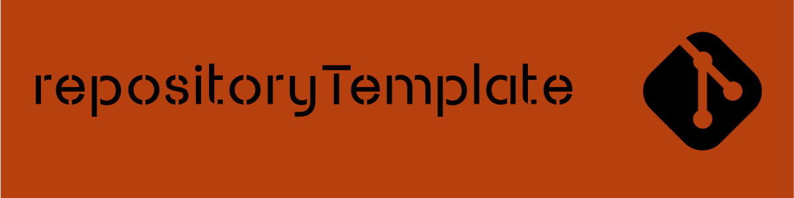
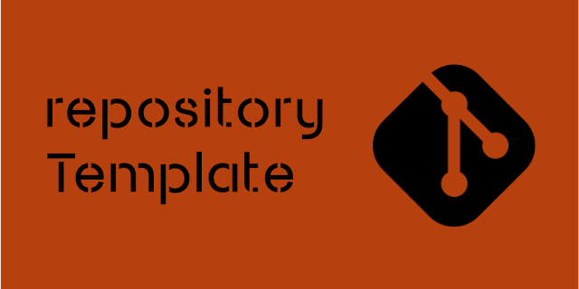

This repository is a _template_ you can [use](https://github.com/bhdicaire/repositoryTemplate/generate) to start new projects with a consistent structure and batteries included.

## :notebook_with_decorative_cover: Ingredients

<details>
<summary>Standard community files</summary>

 * [Code of conducts](.github/CODE_OF_CONDUCT.md) adapted from the [Contributor Covenant, version 3.0](https://www.contributor-covenant.org/version/3/0/) to ensure that no manual changes are required per project
 * [Contributing](.github/CONTRIBUTING.md): reporting bugs & issues, and submitting pull requests based on [Github Flow](https://docs.github.com/en/get-started/using-github/github-flow)
 * [Governance](.github/GOVERNANCE.md): how decisions are made and how contributions are managed
 * [Maintainers](.github/MAINTAINERS.md): lists the maintainers of the project and how to contact them 
 * [Security](./github/SECURITY.md"): don't forget to enable [pertinent features](https://docs.github.com/en/code-security/getting-started/github-security-features) for your repository.
 * [Support](./github/SUPPORT.md") 
</details>
<details>
<summary>GitHub issue and PR templates for bugs, features, docs, and questions</summary>

 * Issues:
   1. [Bug](./github/ISSUE_TEMPLATE/bug.yml)
   2. [Documentation including README.md](./github/ISSUE_TEMPLATE/docs.yml)
   3. [Feature request](./github/ISSUE_TEMPLATE/docs.yml)
   4. [Question or support Request](./github/ISSUE_TEMPLATE/question-support.yml)
   5. [Report a security vulnerability](./github/SECURITY.md) 


</details>

<details>
<summary>Semantic Versioning with changelog guidelines</summary>

All notable changes to the repository will be documented in [CHANGELOG.md](CHANGELOG.md).

The format is based on [Keep a Changelog](https://keepachangelog.com/en) and this project adheres to [Semantic Versioning](https://semver.org/spec/v2.0.0.html).
</details>

<details>
<summary>Preconfigured opinionated settings</summary>

 * [.dockerignore](.dockerignore): opionated Preferences
 * [.editorconfig](.editorconfig): opionated Preferences
 * [.gitignore](.gitignore): 
 * [commitlint.config.js](.commitlint.config.js)
 * [package.json](package.json])
 * [husky/commit-msg](husky/commit-msg]): 

linting
All the markdown follows "MarkdownLint" rules. https://github.com/DavidAnson/markdownlint
</details>

<details>
<summary>README.md</summary>

Your header image should be 1200 × 300 px at 72 DPI.

Refer to [badges](docs/badges.md) to select items. I [documented](docs/emojis.md) the emojis supported by GitHub.

I'm using 'tree -a --filesfirst' to update the project tree.

All the markdown follows "MarkdownLint" rules. https://github.com/DavidAnson/markdownlint

Refer to the [GitHub documentation](https://docs.github.com/en/repositories/creating-and-managing-repositories/creating-a-repository-from-a-template) for more information related to template.
</details>

## How to use

  1. Click to [use](https://github.com/bhdicaire/repositoryTemplate/generate) this template to create a new repository.
- [ ] Replace the placeholders to make sure you customize everything needed
  - [ ] Change the project name and description
  - [ ] Update `.github/MAINTAINERS.md`
  - [ ] Update `.github/SECURITY.md`
  - [ ] Design and replace the images:

      <details>
      <summary>Header</summary>

      Your header image should be 1200 × 300 px at 72 DPI.


      

      All the markdown follows "MarkdownLint" rules. https://github.com/DavidAnson/markdownlint


      </details>

      <details>
      <summary>Social media preview</summary>

      Your social media image should be 640 × 320 px at 72 DPI.

      Upload a [social media image](docs/socialMedia.png) to [customize](https://docs.github.com/en/repositories/managing-your-repositorys-settings-and-features/customizing-your-repository/customizing-your-repositorys-social-media-preview) the social media preview of the repository. 

      
      </details>

  - [ ] Update the README.md
    - [ ] Select [badges](docs/badges.md)
    - [ ] Select [emojis](docs/emojis.md) supported by GitHub
    - [ ] Update the project tree, I'm using `tree -a --filesfirst`
  - [ ] Refer to the [GitHub documentation](https://docs.github.com/en/repositories/creating-and-managing-repositories/creating-a-repository-from-a-template), if you want to create your own template
  

## 🌲 Project tree
```text

.
├── .dockerignore
├── .editorconfig
├── .gitignore
├── CHANGELOG.md
├── LICENSE
├── README.md
├── commitlint.config.js
├── package-lock.json
├── package.json
├── .github
│   ├── CODEOWNERS
│   ├── CODE_OF_CONDUCT.md
│   ├── CONTRIBUTING.md
│   ├── GOVERNANCE.md
│   ├── LICENSE.md
│   ├── MAINTAINERS.md
│   ├── SECURITY.md
│   ├── SUPPORT.md
│   ├── pull_request_template.md
│   └── ISSUE_TEMPLATE
│       ├── bug.yml
│       ├── config.yml
│       ├── docs.yml
│       ├── feature-request.yml
│       └── question-support.yml
├── .husky
│   └── commit-msg
└── docs
    ├── badges.md
    ├── emojis.md
    ├── header.png
    └── socialMedia.png

```

repositoryTemplate by Benoît H. Dicaire is shared with an [MIT license](.github/LICENSE).
Suggestions and improvements are welcome!
