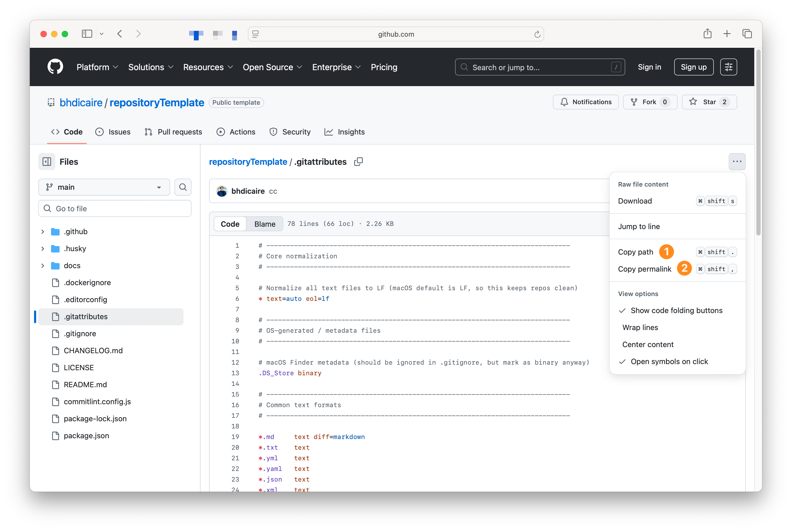

# Best practices

https://webstandards.ca.gov/2023/04/19/github-best-practices

## Best practices for GitHub Repos
:link: 
:memo: 
[:smile:](http://github.com)
:octocat:
:paperclip:
:paperclips
:sparkles:

1. Create a README file to make it easier for people to understand and navigate your work
2. Repositories should be limited to the files necessary for building projects
 * Avoid committing binary files when you can
   * Spreadsheets and presentations are better suited to be hosted on portals that understand how to serve and version them properly
   * Build artifacts, if you must use [Git Large File Storage (Git LFS)](https://docs.github.com/en/repositories/working-with-files/managing-large-files/configuring-git-large-file-storage)
3. Keep sensitive files out of your repository with `.gitignore`

###  Update `.github/MAINTAINERS.md` and `.github/CODEOWNERS.md`

Aha !

###  Update `.github/SECURITY.md`

###  Update `.gitignore` and `.gitattributes`

To keep certain files from displaying in diffs by default, or counting toward the repository language, you can mark them with the linguist-generated attribute in a .gitattributes file [:octocat:](https://docs.github.com/en/repositories/working-with-files/managing-files/customizing-how-changed-files-appear-on-github).

### Design and replace the images

###  Update `README.md`

https://github.com/bhdicaire/repositoryTemplate/blob/608961066353ea6093b0afb6a3e8a504ddf828cf/.gitattributes

            Binary files like spreadsheets and presentations are better suited to be tracked on portals that understand how to serve and version them properly.

###  Getting permanent links to files

When viewing a file on GitHub.com, you can link the version at the current head of a branch: https://github.com/bhdicaire/repositoryTemplate/blob/main/.gitattributes. The version of a file change as new commits are made,thus the file contents might not be the same when someone looks at it later. Unless, you're using the permalink: https://github.com/bhdicaire/repositoryTemplate/blob/608961066353ea6093b0afb6a3e8a504ddf828cf/.gitattributes. It replaces the branch name with the specific commit ID [:octocat:](https://docs.github.com/en/repositories/working-with-files/using-files/getting-permanent-links-to-files).

https://docs.github.com/en/repositories/creating-and-managing-repositories/best-practices-for-repositories

https://docs.github.com/en/code-security/getting-started/quickstart-for-securing-your-repository

https://docs.github.com/en/code-security/getting-started/auditing-security-alerts

## Best practices for GitHub Actions
https://docs.github.com/en/actions/security-guides/using-githubs-security-features-to-secure-your-use-of-github-actions

## Best practices for GitHub Organizations

https://docs.github.com/en/organizations/keeping-your-organization-secure/managing-security-settings-for-your-organization/audit-log-events-for-your-organization

[Compliance](https://docs.github.com/en/organizations/keeping-your-organization-secure/managing-security-settings-for-your-organization/accessing-compliance-reports-for-your-organization)

## Best practices for GitHub Enterprises*
Organizations that use GitHub Enterprise Cloud can interact with the audit log using the GraphQL API and REST API.

https://awes0mem4n.github.io/emojis-github.html
